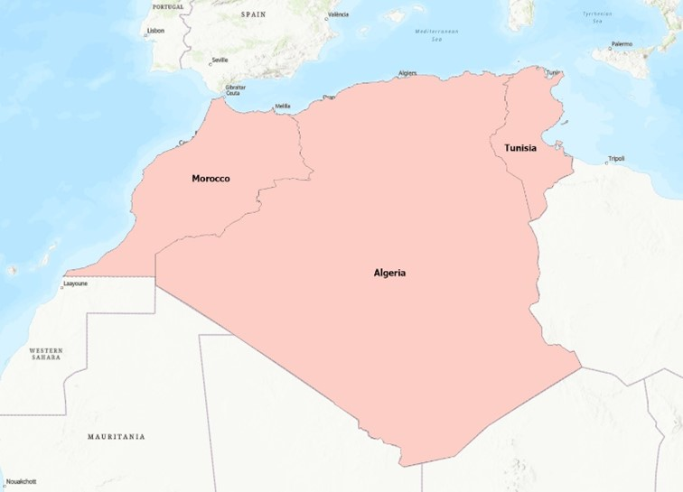
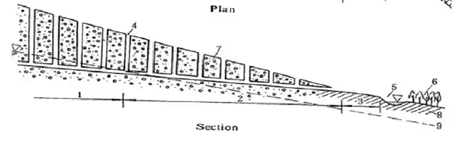
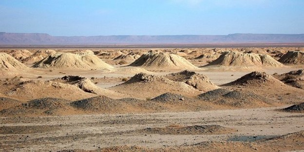
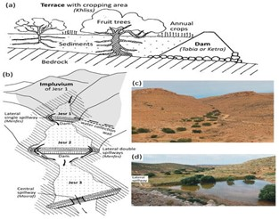

### INTRODUCTION

One distinct characteristic of arid regions is the inadequacy of water or moisture, which may result from biological factors such as the nature of soil or climatic factors such as inadequate precipitation and high evaporation rate. Over the years, the world population has been increasing, and as such population in arid regions has seen a significant increase. Growing populations result in a greater need for water for both residential and commercial purposes. (Hanasaki et al., 2013). Water conservation is the efficient use and management of water resources to meet the needs of the current generation and that of the future generation. In essence, water conservation prevents water from getting wasted (Malekian Jabali et al., 2017). Water conservation techniques may be traditional or non-traditional. Non-traditional water conservation techniques are those techniques that are not developed from the people's culture. Cloud seeding, fog catching, desalination, and iceberg catching are non-traditional water conservation methods. With few studies focusing on the effectiveness of traditional water conservation techniques, this study thus examines the various traditional methods used to conserve water in the dry regions of northern Africa and their effectiveness.

### STUDY AREA

The boundaries of this region have been the subject of multiple debates. The North Africa region stretches from the western Atlantic shores of Morocco through Algeria and Libya to the Suez Canal in Egypt and the Red Sea (Abun-Nasr, 2023). From this definition, Libya, Egypt, Morocco, Algeria, and Tunisia make the countries of North Africa. This region's arid nature is one of its unique features. The infamous Sahara Desert spans throughout this region. The region has semi-arid and arid climates with scorching summers and cold winters with little rain throughout the year (N. I. Council, 2009). Along the coasts of Morocco, Algeria, Tunisia, and parts of Libya and Egypt, the climate is that of the Mediterranean. (N. I. Council, 2009). In addition to the Middle East, North Africa is the world’s most water-scarce region, receiving only two percent of the world’s renewable freshwater. Furthermore, the region's growing population and poor water management are expected to make the shortage of water worse (Dargham, 2019). The conditions that exist in this region require effective water management and practices. Focusing on Morocco, Algeria, and Tunisia, this study reviews the various traditional methods of water conservation and management in this region and their effectiveness.

{width="392"}

### TRADITIONAL WATER CONSERVATION TECHNIQUES

People typically reside near oases and rivers in the desert, and they adopt customary practices to preserve water for usage in household, agricultural, and industrial settings. Most people in Morocco depend on the traditional Khettara water systems because they live close to oases. (Adeel, 2008).

### KHETTARAS / FOGGARAS

For years, water scarcity has been an issue for the residents of the desert areas of Morocco. To solve the issue of water scarcity, residents have adapted to a local water system of conservation known as Khettaras. Khettaras are ancient water systems where residents first identify a groundwater source and then build a series of wells from the water source to their farmlands. A network of subterranean tunnels is then constructed to connect these wells to their farmlands. The tunnels are built in such a way that they permit water to flow through them. The purpose of the wells is to allow air circulation and to provide access for workers to enter the tunnel during maintenance (Fitzwilliam-Hall, 2009).

In general, Khettaras collect the uppermost portion of the water table and use gravity to distribute the water to farmlands. (Idda et al., 2021). Khettaras are known as Foggaras in Algeria.

This water system is a highly developed, old water technique that has been used for irrigation for thousands of years. (Peroni, 2015). The construction of Khettaras is more like communal labor. Each family participates in the construction process and thus the water rights belong to everyone who participates in the construction process. It is a communal system that is typically owned by the entire community rather than by a single individual or family. (Fitzwilliam-Hall, 2009). Just like Khettaras, the Foggaras in Algeria are owned by the people who engaged in the construction of the system and their descendants (Idda et al., 2021).

Figure 1 is the schematic diagram of a Khettara. The part labeled 4 is the air shaft which is designed to allow air to pass through the system. During maintenance, the air shaft serves as an opening for workers to enter the system. The intervals between one shaft and the other are labeled as 7. Part 9 is the water table and 6 is the farmlands or the irrigation land. The inclined nature of the Khettara water system is to allow water to flow towards the irrigation dam.

{width="641"}

***Source:** The Living Khettāras of Southern Morocco: A Traditional Water Harvesting Technology on the Brink (Fitzwilliam-Hall, 2009), retrieved on October 16, 2023, <https://www.academia.edu/5069877>*

Khettaras has been a beneficial and sustainable method of acquiring water and conserving it in the desert areas of Morocco and Algeria in the case of Foggaras. But they have been deserted and allowed to deteriorate (El Faiz & Ruf, 2010). Among the numerous reasons for the water system's abandonment is the reduction in the importance of agriculture to the economy and the installation of hand pumps in the 1970s which caused over-pumping and consequently decreased water levels, ultimately causing the majority of the Khettaras to dry up. (Peroni, 2015). The establishment of the nationwide irrigation dams is also a reason for the reduction in water levels as they prevented the downstream recharge of aquifers (Fitzwilliam-Hall, 2009). Both the construction and maintenance of Khettaras are labor intensive and considering the reduction in the amount of flow, resulting from over-pumping, most communities have given up on the Khettara water systems (Fitzwilliam-Hall, 2009). While researchers and organized community farmers interested in cultural preservation blame over-pumping, engineers who think modern technology is flawless often point the finger at prolonged droughts as the primary cause of the declining water table. (Faiz & Ruf, 2009).

{width="615"}

**Image source:** *Khettaras: The ancestral irrigation systems of Errachidia (Rédaction, 2021), Retrieved on November 20, 2023 from, <https://www.agrimaroc.ma/khettaras-irrigation-ancestraux-errachidia/>*

Whether it was the drought or over-pumping, one major reason that led to the decline of the Khattera water system was institutional management (Faiz & Ruf, 2009). The management of the Khattera is governed by customary law and it is the duty of the traditional water organization which is composed of water users to supervise and manage the various Khattera systems in each community. In addition, local associations that are established to prepare development plans and projects for Khattera communities also play a management role (Adeel, 2008). Therefore, it is without a doubt that the management of the Khattera water system requires strong leadership and communal participation. However, the reduction in the water levels in most Khatteras has reduced the motivation of community members and a reduction in the activeness of associations and organizations.

In the few places in southern Morocco where there is the motivation to manage Khatteras, organizations, and associations are faced with issues of inadequate funding (Adeel, 2008). To battle the issue of the dying Khattera systems, the Moroccan government has established a recovery plan to revive the various Khatteras in the country to deal with the issue of water scarcity in the region. Over the years, Non-governmental organizations have also come in with their support (Peroni, 2015).

Khatteras have proven to be useful, but because the level of the water table is dependent on precipitation, insufficient precipitation in this region creates a disadvantage for the Khettera water system, which has resulted in the abandonment of many Khettaras in many Moroccan villages. In addition to this disadvantage, Khatteras are easily destroyed in the event of an earthquake. Its great demand for labor has also proven to be a downside. Without a doubt, the most significant limitation of Khattaras is that it is labor intensive in both construction and maintenance. (Beaumont et al., 1989; Fitzwilliam-Hall, 2009).

However, despite the downsides, Khatteras have proven to be very sustainable in the sense that the system provides a source of water without depleting the underground water resources as compared to water pumps. Since Khatteras are made to collect water from the top of the water table, they can collect the amount of water that is naturally present. (Fitzwilliam-Hall, 2009). The construction and maintenance may be very labor intensive; however, the extraction of the water requires no human, animal, or mechanical efforts but gravity alone. For this reason, no extra cost is required for the extraction. In a developing economy with unstable electricity, this method of water conservation is very effective.

### JESSOUR

Tunisia's environment is characterized by arid and semi-arid climates, water scarcity, and significant irregularity in water resources. It is therefore not surprising that a series of severe droughts have led to cuts in water supply (N. R. Council, 2007). Despite its scarce water resources, the country is characterized by torrential rainfall. For this reason, most traditional methods of water conservation are based on rainwater harvesting and storage.

Jessour is a traditional method of water harvesting and conservation whereby locally made earthen dykes or dams known as “tibia” are constructed along valley floors to block runoff water (Gasmi et al., 2021). In valleys, a series of dams are built to slow down runoff and retain water for agricultural purposes. The system is built to store the highest amount of water possible after every rainfall. It is estimated that Jessour can supply water for a hydrologic year after one torrential rainfall (Abdelli et al., 2017). The structure consists of three components: the Dam, Terrace, and the Catchment area (also known as an Impluvium). The dam, also known as “Tibia” is a locally made dyke usually 2 to 5 meters high with a spillway channel. The spillway channels are usually made of stones. The cropping area is the Terrace and the Impluvium is the reservoir (Bonvallot, 1992; Calianno et al., 2020). Thus, the system begins with the dam and ends with the catchment area.

***Source:** Benefits of Water-Harvesting Systems (Jessour) on Soil Water Retention in Southeast Tunisia (Calianno et al., 2020)*, *accessed on October 10, 2023, from*  <https://www.researchgate.net/publication/338735264>

In Figure 3, the parts labeled (a) and (b) show the general view of a typical Jessour water system. (c) is a picture of a terrace and (d) is a catchment area.

Due to the erosive nature of the rainfall, these dykes also help to trap silt from upstream. The dykes are made up of mud and are sometimes reinforced with stones and wood. The frequent deposition of silt and sediment in the system requires that its height be raised after every rainfall. To prevent the system from being damaged, excess water is discharged through an opening reinforced with dry stones (Terrace). (Piras et al., 2022). The deposition of sand at the base of the system provides fertile soil because these sands are filled with organic matter. In addition, the retention of water in the system helps to increase infiltration which helps with groundwater recharge.

Despite their importance, these systems are faced with several issues which include the destruction of the system during torrential rainfalls which leads to water spillage and then eventually water loss and flooding. Also, in situations where the deposited sand or silts are made up of clayey silts, infiltration rates tend to decrease, and groundwater discharge decreases (Piras et al., 2022). Due to the exposure of the system to wind and sunlight, evaporation tends to decrease the amount of water in the system. Jessour is not the only form of traditional rainwater harvesting in Tunisia, but it is one of the oldest methods of rainwater harvesting in the form of runoff. Other methods of rainwater harvesting in this region are usually in small quantities and more domestic. The roof water harvesting technique which involves capturing rainwater that falls from the roof into reservoirs and tanks is an example of such a domestic method. The Jessour runoff harvesting system for years has helped with the water scarcity issues in many Tunisian communities.

### TRADITIONAL WATER CONSERVATION METHODS VERSUS MODERN METHODS

Modern methods of water conservation and traditional methods have both proven to be very effective. Both methods have also proven to be effective in situations where the other lags. Modern methods of water conservation simply involve the use of modern technology in water storage and management. There exist various modern methods of water conservation and management, some of which are discussed below.

Desalination involves the treatment of salty seawater into usable water, and it is an example of modern water conservation methods that have proven to be very effective in arid climates. However, like many other new technologies, the process of desalination, apart from being expensive, also comes with some environmental costs. Carbon emissions from desalination plants are one of the environmental costs that must be considered in production. With regard to production cost, although research has proven that the cost of desalination has been reducing gradually since the 1960s, it is still an expensive method of water conservation for most regions in the world when compared with other methods (Zhou & Tol, 2005). It must also be noted that not all arid regions are close to the sea, and for that reason, desalination becomes even more expensive in regions that are far from the sea, as the cost of production includes transportation and transport parties.

Regarding proximity to sea, Algeria, Morocco, and Tunisia have no issues, since they line the Mediterranean Sea. Algeria has been using the desalination method to reduce water stress in times of intense droughts and it has proved effective (Belhassan, 2022). The Foggaras in Algeria have been an efficient way of water conservation, but due to the abandonment of most of the Foggaras, their importance has reduced. Therefore, it is not surprising that the country has adopted a modern method of conservation. Other rain-enhancing techniques such as cloud seeding have so far helped solve the water scarcity issues in some dry regions of the world (Sahu, 2019). Installation of water pumps for domestic and commercial use as well as water sprinklers for irrigation can all be considered modern water conservation techniques.

All methods of water conservation, whether traditional or modern, have their unique merits and demerits. In as much as modern methods have proven to be very effective; the cost of construction, reducing water table levels and water quality, and health issues among others have been a downside. Comparing traditional techniques to modern methods, it is obvious that traditional methods are less effective than modern methods of water conservation, however, traditional methods have shown to be more sustainable than modern techniques. For example, the Khatteras in Morocco and the Foggaras in Algeria have proven to be more sustainable methods of tapping underground water resources than machine pumps. The reason for this as stated in the previous headings is that the Khatteras or Foggaras capture the underground water that is naturally available at any given time. However, machine pumps can pump underground water without limit, and this often leads to a decline in the water table level which tends to affect surface water quantity and then have a ripple effect on plant and animal life in arid climates.

Despite their downsides, modern methods of water conservation and management have helped with solving the issues of food scarcity in arid regions as they have increased irrigation. In Morocco and Tunisia, desalination methods have been used to treat salty seawater for irrigation during periods of drought (Belhassan, 2022). In other arid climates, cloud seeding has been used to ensure all-year-round agriculture production (Sahu, 2019).

### SUMMARY, RECOMMENDATIONS, AND CONCLUSION

Water scarcity in arid regions comes with the need for effective water conservation practices. In the arid regions of North Africa, Morocco, Tunisia, and Algeria from ancient times have adopted traditional water conservation techniques to deal with the water scarcity issues in the region. These methods of water conservation have proven to be very effective in serving the needs of local communities for both domestic and commercial purposes. Compared to modern methods, these traditional methods of water conservation have proven to be more sustainable and environmentally friendly. Traditional methods have also demonstrated their ability to bring communities together. For example, the Khettaras in Morocco and the Foggaras in Algeria apart from serving their purpose of conserving water also enhanced community engagement since the whole community shared ownership rights. In Tunisia, areas that have the Jessour water system have experienced high agricultural productivity due to the accumulation of sediments and fertile soil behind the dikes (dams) of the system. This system is also capable of supplying water for an entire farming year with as little one torrential rainfall in a year.

These traditional methods of water conservation, despite their importance, have shown weaknesses when compared to modern methods of conserving water. Modern methods on the other hand, although very effective, have also shown weaknesses in certain aspects. The three countries in the study area, after abandoning most of their traditional methods, have adopted modern methods of water conservation, yet are still faced with issues of water scarcity especially in their rural communities. To help solve the issue of water scarcity in this region, this paper has identified the need to combine traditional water conservation methods with that of the modern.

The combination of both methods of water conservation will not only improve water availability in these regions but will also improve domestic income and reduce poverty in rural communities in these regions. This is because the combination of both methods will lead to an inexpensive supply of water for farming communities, and as a result, help to increase agriculture production. An increase in agriculture production is expected to increase domestic income as well as reduce unemployment in rural farming communities.

Combining both water conservation methods means that abandoned traditional methods must be revived. These revitalization projects will eventually come with a new set of costs and issues associated with planning and policy-making. For example, the revitalization of the Khettaras and Foggaras would mean that there is going to be a reduction in the number of hand-pumps in various communities where revitalization projects take place to help restore the groundwater table. In the short run, reducing the number of hand pump machines might lead to minor water issues, but in the long run, benefits would exceed that of the short run. At the same time, there would be the need to build up old and damaged Khettaras or Foggaras. This means that great funding is needed for the redevelopment project.

As in the case of Morocco, Algeria, and Tunisia, inadequate and lack of funding has been the major issue hindering the revitalization of these traditional water systems. To ensure the effective revitalization of these water systems at a reduced cost, this paper suggests that the governments in these countries collaborate with private organizations and NGOs to implement the plan. Also, including traditional water systems sites in eco-tourism would help with their regular maintenance through revenue generation.

Since traditional methods of water conservation are embedded in the culture and lifestyle of the people in these regions, a simple revitalization alone is not enough to ensure the continued existence of these systems. As stated by the Young Water Professionals Morocco, knowledge about the traditional systems from ancient times has been transmitted through oral teachings and folklore and as a result, increased emigration has been a hindrance to knowledge transmission and hence the abandonment of many traditional systems of water conservation (YWP, 2023). To ensure the continued existence of the redevelopment project, this paper would recommend that the governments in these areas encourage the teaching of traditional water conservation methods in schools and training centers to help sharpen the interests of the new generation in supporting traditional water conservation methods. The above recommendations, if implemented, will help reduce the water stress in these regions, especially in their rural communities.

### REFERENCES

Abdelli, F., Ouessar, M., M’Hemdi, S., Guied, M., & Khatteli, H. (2017). Monitoring soil moisture content of jessour in the watershed of Wadi Jir (Matmata, Southeast Tunisia). Water and Land Security in Drylands: Response to Climate Change, 97-110.

Abun-Nasr, J. M., Warmington, . Brian H. and Brett, . Michael. (2023). North Africa. Encyclopedia Britannica., from <https://www.britannica.com/place/North-Africa>

Adeel, Z. (2008) What Makes Traditional Technologies Tick? A Review of Traditional Approaches for Water Management in Drylands (pp. 86). United Nations University: United Nations University.

Beaumont, P., Bonine, M., & McLachlan, K. (1989). QĀn‾t, Kariz & Khattara. University of London/SOAS, London.\
Belhassan, K. (2022). Managing Drought and Water Stress in Northern Africa. Arid Environment.

Bonvallot, J. (1992). Plaidoyer pour les jessour. L’aridité: une contrainte au développement. Caractérisation, réponses biologiques, stratégies des sociétés, 507-517.

Calianno, M., Fallot, J.-M., Ben Fraj, T., Ben Ouezdou, H., Reynard, E., Milano, M., . . . Adatte, T. (2020). Benefits of Water-Harvesting Systems (Jessour) on Soil Water Retention in Southeast Tunisia. Water, 12(1), 295.

Council, N. I. (2009). North Africa: The Impact of Climate Change to 2030 (Selected Countries): A Commissioned Research Report.

Council, N. R. (2007). Water in Tunisia: A National Perspective." National Research Council. 2007. Agricultural Water Management: Proceedings of a Workshop in Tunisia. Washington, DC: The National Academies Press. doi: 10.17226/11880.

National Academies of Sciences, Engineering, and Medicine. 2007. Agricultural Water Management: Proceedings of a Workshop in Tunisia. Washington, DC: The National Academies Press. <https://doi.org/10.17226/11880>.

Dargham, R. A. (2019). Water doesn't come from a tap. Retrieved 10/20, 2023, from <https://www.unicef.org/mena/water-doesnt-come-tap#>:\~:text=2.,region%20is%20likely%20to%20worsen.

El Faiz, M., & Ruf, T. (2010). An Introduction to the Khettara in Morocco: Two Contrasting Cases.' In Schneier-Madanes, G., Courel, M., (eds). Water and Sustainability in Arid Regions: Bridging the Gap Between Physical and Social Sciences., p. 158.

Faiz, M., & Ruf, T. (2009). An Introduction to the Khettara in Morocco: Two Contrasting Cases Water and Sustainability in Arid Regions (Springer Netherlands).

Fitzwilliam-Hall, S. (2009). The Living Khettāras of Southern Morocco:A Traditional Water Harvesting Technology on the Brink.

Gasmi, I., Eslamian, S., & Mohamed, M. (2021). Evaluation of Traditional Rainwater Harvesting Technique of "Jessour" in Southern Tunisia, a Case Study on El-Jouabit Catchment (pp. 199-212).

Hanasaki, N., Fujimori, S., Yamamoto, T., Yoshikawa, S., Masaki, Y., Hijioka, Y., . . . Takahashi, K. (2013). A global water scarcity assessment under Shared Socio-economic Pathways–Part 2: Water availability and scarcity. Hydrology and Earth System Sciences, 17(7), 2393-2413.

Idda, S., Bonté, B., Kuper, M., & Mansour, H. (2021). Revealing the Foggara as a Living Irrigation System through an Institutional Analysis: Evidence from Oases in the Algerian Sahara. International Journal of the Commons.

Malekian Jabali, M., Okhravi, S., Eslamian, S., & Gohari, S. (2017). Water Conservation Techniques, Ch. 27 in Handbook of Drought and Water Scarcity, Vol. 2: Environmental Impacts and Analysis of rought and Water Scarcity, ed. Eslamian S. and Eslamian F., Francis and Taylor.

Peroni, L. (2015). THE KHETTARA WATER MANAGEMENT ANCIENT TECHNIQUES PROMOTED IN MOROCCO Retrieved from <https://www.ideassonline.org/public/pdf/Khettaras-ENG.pdf>

Piras, F., Zanzana, A., Costa Pinto, L. M., Fiore, B., & Venturi, M. (2022). The role of the jessour system for agrobiodiversity preservation in Southern Tunisia. Biodiversity and Conservation, 31(10), 2479-2494. doi: 10.1007/s10531-021-02286-5

Rédaction, L. (2021, December 16). Khettaras: Les systèmes d’irrigation ancestraux d’Errachidia. Retrieved November 20, 2023, from <https://www.agrimaroc.ma/khettaras-irrigation-ancestraux-errachidia/>

Sahu, K. K. (2019). Importance and utility of cloud seeding in agriculture. <https://www.slideshare.net/KhileshKumarsahu/importance-and-utility-of-cloud-seeding-in-agriculture-149323246>

YWP, M. I. (2023, July 6). Abandonment of Khettaras in Morocco - Causes and Recommendations. Retrieved November 17, 2023, from <https://www.linkedin.com/pulse/abandonment-khettaras-morocco-causes?trk=public_post_main-feed-card_reshare_feed-article-content>

Zhou, Y., & Tol, R. S. J. (2005). Evaluating the costs of desalination and water transport. Water Resources Research, 41(3). doi: <https://doi.org/10.1029/2004WR003749>
