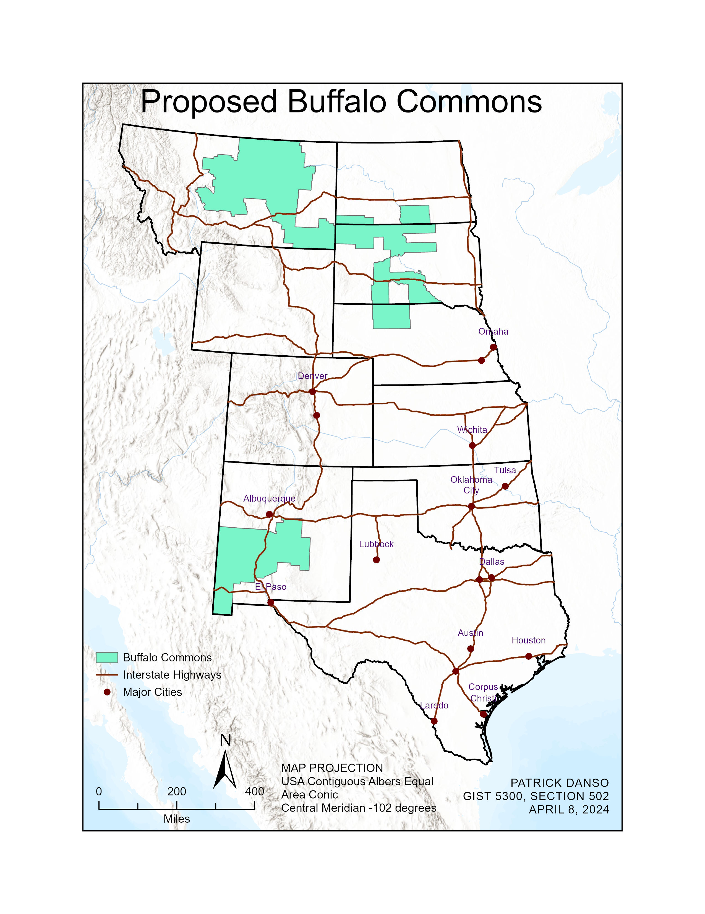

### INTRODUCTION

One of the issues associated with the increasing population of humans is their impact on biodiversity. As the human population increases, their impacts and influence on biodiversity also increase. To reduce human impacts on biodiversity, measures such as nature preserves have been introduced to maintain and safeguard biodiversity and to provide a sanctuary for species(NationalGeographic 2019). Over the years, many have come up with ideas on how to set up various nature preserves, as well as where to locate these preserves.

Among such proposals is the one introduced by Frank J. Popper and Deborah Popper in a 1987 essay. The idea was to create an extensive nature preserve by restoring 139,000 square miles (360,000 km²) of the drier portion of the Great Plains to native prairie (Grassland Ecosystem) and then reintroduce the American bison, also known as Buffalo, that once grazed the short grass prairie. Their proposal was termed the Buffalo Commons (Barbato 2021).

The main reason for their proposal was that, during that time, there was a steady decline in the rural population because of the introduction of mechanized agriculture. Hence, fewer people were needed to cultivate the larger parts of the land. The region's rural economy suffered greatly due to periodic disasters such as the Dust Bowl, especially in the drier parts. Thus, Frank J. Popper and Deborah Popper argued that the area wasn’t sustainable for large-scale commercial farming (Wikipedia 2024).

Thus, to shift a significant portion of the region away from intensive farming and ranching practices and to address environmental and economic challenges in the plains, where population declines and unsustainable land use have been observed, they proposed the Buffalo Commons. After its proposal, the Buffalo Commons did not receive as much attention as it should have, however, as the years went by, it has received the attention of policymakers, yet one problem remains. Finding the best location for the Buffalo Commons has been a challenge to policymakers, it is for this reason that this project is being conducted.

The purpose of this project is to find the best location for the Buffalo Commons using five main variables which include, population density, population change, farmland value, percent federal lands, and counties adjacent to Indian reservations.

### METHODS

As stated earlier, the five variables used in this project include Population density, population change, farmland value, percent federal lands, and counties adjacent to Indian reservations. Since the Buffalo Commons is a nature preserve, it is best situated in an environment that will have fewer human impacts, so assessing the population density of the area before selection is important. In this project, suitability ranks were assigned to population density. The ranks ranged from 1 through to 5, with the highest ranks being more suitable for locating the Buffalo Commons. The highest ranks relate to counties with low population density and vice versa.

In most cases, counties may have low population densities, however, they may have a good potential to increase in the future which makes it not suitable for locating buffalo commons. In this case, there is a need to assess the population change for the various counties. To do this, Suitability ranks were assigned to the population change attribute table to determine the best counties for locating the Buffalo Commons. Counties with a declining population are preferred to increasing populations. The suitability ranks ranged from 1 through to 5, with 5 representing counties with the highest population decline.

Land Value was the third variable used to determine suitability. Here, farmlands with low value or cost are preferred to high-value farmlands due to budget restrictions. For this reason, farmlands with the lowest value were assigned a high suitability rank of 5, while the high-value farmlands were given low suitability ranks. The suitability ranks range from 1 to 5.

Federal lands are lands that are owned by the government; thus, it is easier to acquire those lands than those that are privately owned. For this reason, the counties with the highest federal lands are preferred and more suitable for the Buffalo Commons, and thus, they were assigned the highest suitability rank. The suitability ranks ranged from 1 through to 5.

Lastly, counties that are adjacent to Indian reservations are preferred to those that are not. The select by location tool was used to select counties that are within 5 US Survey miles of Indian reservations, and they were assigned a rank of 1 to indicate that they are adjacent to Indian reservations. All the rest were assigned a rank of 0 to indicate that they were not adjacent to Indian reservations.

### STUDY AREA

With much of it covered in steppe, prairie, and grassland, the Great Plains lies just to the east of the Rocky Mountains in the United States (Fenneman 1917; Robinson 2023). It is bordered by the Rio Grande in the south. It is a large expanse of flatland in North America (Robinson 2023). The Great Plains consists of Ten (10) states, which include, Montana, North Dakota, South Dakota, Wyoming, Nebraska, Kansas, Colorado, Oklahoma, Texas, and New Mexico. In total, there are about 824 counties in this region. Below is a map of the study area.

{width="685"}

### POPULATION DENSITY

The number of people living in a particular area divided by the total size of the area is termed population density. High population density is an indication that there are more people concentrated in a particular area. The goal of this project is to identify areas that have low population density. Thus, a suitability rank was assigned to various counties in this region ranging from 1 to 5, with the highest suitability rank being 5. The highest rank of 5 was given to counties with low population density. A rank of 1 was given to cities with high population density, in this case, low suitability.

The method of classification used for this variable was Quantile. A suitability rank of 5 was very highly suitable, 4 was highly suitable, and 3 was moderate. Ranks 2 and 1 were low suitability and very low suitability respectively.

On the population density map, the yellow color represents counties with very low population density and thus was assigned a rank of 5. The counties with red color had high population density and were thus assigned a rank of 1. The color gradient ranges from yellow to red with colors closer to yellow having low density and high suitability. The colors close to red have high density and hence low suitability. The orange color represents moderate suitability with moderate population density.

Below is a table showing the population density classification.

| Class Range  | Suitability Rank | Description of Population Density | Description of Suitability Rank |
|------------------|------------------|-------------------|------------------|
| 0.1 - 2.9    | 5                | Very Low (5)                      | Very High Suitability           |
| 3.0 - 6.6    | 4                | Low (4)                           | High Suitability                |
| 6.7 - 15.4   | 3                | Moderate (3)                      | Moderate Suitability            |
| 15.5 - 42.0  | 2                | High (2)                          | Low Suitability                 |
| 421 - 3879.7 | 1                | Very High (1)                     | Very Low Suitability            |

: ***Table 1: Population Density***

From the map, most of the counties in the northern part of the Great Plains have a higher suitability ranking than those in the southern part. Montana, Wyoming, North, and South Dakota, and most of the western part of Texas have low population density and high suitability rankings in general. Below is the population density map.

{width="540"}

### POPULATION CHANGE

Population changes measure the extent to which the population of a country increases or decreases over a particular period. Nature reserves are thus best situated in areas with declining human populations than those with increasing populations. The population change variable in this project was used to identify the rate of increase or decrease in the populations of counties in the Great Plains. Counties with decreasing populations were assigned a high suitability ranking while those with increasing populations were assigned a lower suitability ranking. The suitability ranking ranged from 1 through to 5, with 5 being the highest suitability rank.

The Population change variable was classified using the manual interval method with five classes. A suitability rank of 5 was very highly suitable, 4 was highly suitable, and 3 was moderate. Ranks 2 and 1 were low suitability and very low suitability respectively.

On the population change map, the yellow color represents counties with high decreasing populations and thus was assigned a rank of 5. The counties with red color had a high increasing population and were thus assigned a rank of 1. The color gradient ranges from yellow to red with colors closer to yellow having low population change and high suitability. The colors close to red have high population change and hence low suitability. The orange color represents moderate suitability with stable population change. Below is a table showing the classification of population change and the population change map.

| Class Range | Suitability Rank | Description of Population Change | Description of Suitability Rank |
|------------------|------------------|-------------------|------------------|
| \<= -10     | 5                | Large Decline                    | Very High Suitability           |
| \<= -2      | 4                | Decline                          | High Suitability                |
| \<= 2       | 3                | Stable                           | Moderate Suitability            |
| \<= 10      | 2                | Growth                           | Low Suitability                 |
| \>10        | 1                | Large Growth                     | Very Low Suitability            |

: ***Table 2: Population Change Classification***

From the map, most of the counties in the eastern part of the Great Plains have yellow symbology, indicating higher population decline than those in the western parts of the plains.

{width="540"}

### FARMLAND VALUE

One of the most important aspects of this project is to purchase the farmlands from the farm owners for the Buffalo Commons. With a limited budget of 20 billion USD, coupled with the need to get the maximum number of farmlands possible to establish the Buffalo Commons, there is a need to select the farmlands that have the lowest value or cost. It should be noted that the farmers need to be paid twice the price of the farmland as a form of incentive. For this reason, we must look out for farmlands whose value is equal to or a little bit less than 10 billion USD. Counties with low farmland values and cost were assigned a high suitability rank of 5, with those of high values and cost having a suitability rank of 1. The suitability ranking ranged from 1 through to 5.

The method of classification used for this variable was the Quantile classification method. Land values less than or equal to 236 were the least with the highest suitability rankings. The highest value was greater than 716 and it had the lowest suitability ranking of 1. High suitability rankings are represented by the yellow color and the least suitability ranking is shown with red. The color gradient ranges from yellow through to red.

| Class Range | Suitability Rank | Description of Farmland Value | Description of Suitability Rank |
|------------------|------------------|------------------|-------------------|
| \<= \$236   | 5                | Very Low                      | Very High Suitability           |
| \<= \$335   | 4                | Low                           | High Suitability                |
| \<= \$459   | 3                | Moderate                      | Moderate Suitability            |
| \<= \$718   | 2                | High                          | Low Suitability                 |
| \> \$718    | 1                | Very High                     | Very Low Suitability            |

: ***Table 3: Land Value Classification***

From the map, most of the counties in the western parts of the Great Plain have low farmland values, this is represented by the yellow color. Montana, Wyoming, and New Mexico are the states with the lowest land values. Counties in eastern Texas have most of the counties with the highest land values, which are represented in red color. Below is a map of Farmland Value.

{width="540"}

### PERCENT FEDERAL LANDS

Farmlands that are owned by the government are known as federal lands. These federal lands are much easier to purchase than those that are privately owned. The goal of this project is to get as many farmlands as possible for the establishment of the Buffalo Commons, as such, federal lands provide a higher potential for land acquisition than private farmlands. The percent federal land variable was used to determine the counties with the highest percent federal lands and those with the lowest. Counties with the highest percent federal lands were preferred to those with low percent federal lands and thus were assigned a suitability rank of 5. Those with the lowest percentage of federal lands were assigned a suitability rank of 1. The suitability rank ranged from 1 through to 5, with 5 being the highest suitability rank.

The Natural Breaks classification method was used for this variable. The lowest classification value was less than 4.8 percent and the highest was greater than 60.1 percent. The most suitable areas were represented with the yellow color and the least suitable places were represented with the red color. Below is the classification table for the percent federal land variable.

| Class Range | Suitability Rank | Description of Percentage | Description of Suitability Rank |
|------------------|------------------|------------------|------------------|
| \> 60.1%    | 5                | Very High                 | Very High Suitability           |
| \<= 60.1%   | 4                | High                      | High Suitability                |
| \<= 31.7%   | 3                | Moderate                  | Moderate Suitability            |
| \<= 15.4%   | 2                | Low                       | Low Suitability                 |
| \<= 4.8%    | 1                | Very Low                  | Very Low Suitability            |

: ***Table 4: Percent Federal Lands Classification***

From the map, almost the entire eastern part of the plains has low percentages of federal land, this is evident with the red color shown on the map. The few counties with the highest percentage of federal lands can be found in the states of New Mexico, Colorado, Wyoming, and Montana. The Percent Federal Lands map is shown below.

{width="540"}

### COUNTIES ADJACENT TO INDIAN RESERVATIONS

Counties adjacent to Indian reservations are better for the situation of Buffalo Commons. In this project, a special query was conducted using the select by location tool to select counties that are 5 US Survey Miles from Indian reservations. Here, counties that are adjacent to Indian reservations were assigned a suitability rank of 1, and those that are not adjacent to the reservations were assigned a suitability rank of 0.

The counties that were adjacent to the Indian reservations were symbolized with a yellow color and those that are not adjacent are in white. The Indian reservations are symbolized with the pink color. The method of classification used was the natural breaks. The classification ranged from 0 to 1, with 1 being counties adjacent to Indian reservations.

| Class Range | Suitability Rank | Description of Class | Description of Suitability Rank |
|------------------|------------------|------------------|-------------------|
| 1           | 1                | Adjacent             | Suitable                        |
| 0           | 0                | Not Adjacent         | Not Suitable                    |

: ***Table 5: Counties Adjacent to Indian Reservations Classification***

From the map, Montana, Wyoming, New Mexico, North, and South Dakota are the states that have the highest number of counties that are adjacent to Indian reservations. None of the counties in Texas are adjacent to Indian reservations.

On the map, Indian reservations are represented in the pink color, and the counties that are adjacent to them are represented in the yellow color. The white spaces represent counties that are not adjacent to Indian reservations. Below is the map of the counties that are adjacent to Indian reservations.

{width="540"}

### FINAL SUITABILITY RESULTS

After all the maps were created with ranks assigned to each variable, the next step was to create a final suitability layer to determine the best place to establish the Buffalo Commons. To do this, the attribute tables for the variables were joined into one table using the FIPS Code value for each county. After joining all the tables, a final suitability feature layer was created with two additional fields. The fields were the final suitability rank field and the total cost of farmland. To create the final suitability rank field was created by adding the suitability rank for each variable and then dividing it by 4.2. The number 4.2 was derived by adding the maximum number of suitability ranks possible by the number of variables. In this case, the highest possible suitability number was 21 divided by the number of variables which is 5.

The final suitability rank ranged from 1 through to 5 with 5 being the highest suitability rank and the lowest suitability rank being 1. The final suitability layer was classified using the Quantile method with 5 classes. The highest class was 4.5 representing high suitability with the lowest being 1.7 indicating low suitability. The most suitable counties are symbolized with yellow, and the least suitable counties are symbolized with red. The color symbology ranges from yellow through to red.

| Class Range | Suitability Rank | Description of Class | Description of Suitability Rank |
|------------------|------------------|------------------|-------------------|
| \> 4.5      | 5                | Very High            | Very High Suitability           |
| \<= 3.6     | 4                | High                 | High Suitability                |
| \<= 3.1     | 3                | Moderate             | Moderate Suitability            |
| \<= 2.4     | 2                | Low                  | Low Suitability                 |
| \<= 1.7     | 1                | Very Low             | Very Low Suitability            |

: ***Table 6: Final Suitability Classification***

From the map, Montana, Wyoming, and New Mexico have the most counties with high suitability. North and South Colorado has a few counties with high suitability as well as Colorado. Texas, Oklahoma, and Kansas have the least suitable counties. The Final Suitability map is shown below.

{width="540"}

### PROPOSED BUFFALO COMMONS

Finally, I selected the counties that have high suitability ranking and farmlands that cost a little bit less than 10 billion USD. My proposed areas for the Buffalo Commons were in the states of Montana, New Mexico, Nebraska, and North and South Dakota. The total cost of farmlands for my proposed locations was \$9,928,664,218. A total of 44 counties were selected.

The selection of the counties for the Buffalo Commons was influenced by several factors such as the presence of interstate highways and proximity to big cities. Since the Buffalo Commons is a nature preservation site, it is better to be far from large cities as well as highways. For this reason, I chose locations that are not too close to large cities with too many populations. Also, I tried to minimize the proximity to highways as much possible as it can be. From the map, even though some highways pass through the Buffalo Commons in the northern and southern parts, it is the best location possible considering all available restrictions.

The selected location for the Buffalo Commons is symbolized by the green color. The highways are shown with brown lines and the big cities are represented as points with their names marked beside them. The map of the Proposed Buffalo Commons is shown below.

{width="540"}

### CONCLUSION

The need to create nature reserves to protect biodiversity from human impacts comes with the need to find the best locations to place these reserves. After the lands in the Great Plains became unsustainable for commercial farming, due to the various disasters and declining population, there became a need to use the plains as a nature reserve for American Bisons. Even though this idea, after it was introduced, did not receive much attention has now become relevant to policymakers and thus, there has been a need to find the best location to situate this Buffalo Commons. This project aims to find the best places within the Great Plains to locate these buffalo commons. 

This project used five variables to determine the best location for the Buffalo Commons. These variables included Population Density, Population Change, Farmland Value, Counties Adjacent to Indian Lands, and Percent Federal Lands. These variables were assigned suitability ranks, and then analyses were made using ArcGIS Pro. 

Based on the above-mentioned variables, a final suitability rank was developed to determine the best locations for the Buffalo Commons. After reviewing various conditions that may affect the Buffalo Commons, such as proximity to large cities and the presence of highways, I selected counties in four States, which include Montana, North and South Dakota, and New Mexico. 

The Construction of the Buffalo Commons comes at a cost. Considering the 20 billion USD budget constraints and a need to compensate landowners by paying them twice the amount of the land, I made sure that the total cost of the farmlands to be purchased was less than 10 billion USD. To be precise, the total projected cost of land purchase was $9,928,664,218. Approximately, 228,519 people would be affected by the construction of Buffalo Commons.

In Conclusion, this paper has been able to identify the best places within the Great Plains for the establishment of the Buffalo Commons. Thus, to look out for a detailed explanation of the best location to establish the Buffalo Commons and how to identify the best places for the Commons, the above explains all. 

### REFERENCES

Barbato, L.S. 2021. Geographic Information System Lab Manual. 7th ed. Texas Tech University.

Fenneman, N. M. 1917. "Physiographic Subdivision of the United States."  Proc Natl Acad Sci U S A 3 (1):17-22. doi: 10.1073/pnas.3.1.17.

NationalGeographic. 2019. "Protected Areas Have a Lot of Benefits. Here’s How to Maximize Them.". NationalGeographic, accessed April 22. https://news.nationalgeographic.org/protected-areas-have-a-lot-of-benefits-heres-how-to-maximize-them/.

Robinson, E. B. and Dietz, John L. 2023. "Great Plains. Encyclopedia Britannica." Last Modified October 17, accessed April 22. https://www.britannica.com/place/Great-Plains.

Wikipedia. 2024. "Buffalo Commons. (2024, April 12). In Wikipedia. https://en.wikipedia.org/wiki/Buffalo_Commons." Last Modified April 12, accessed April 22. https://en.wikipedia.org/wiki/Buffalo_Commons.